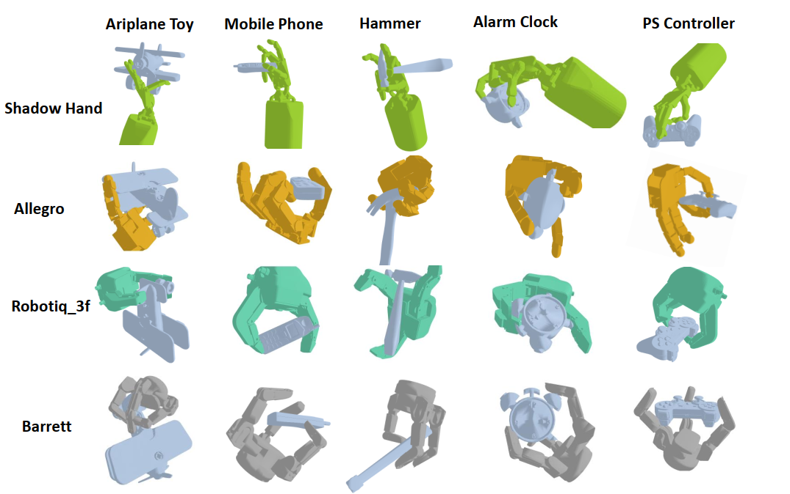
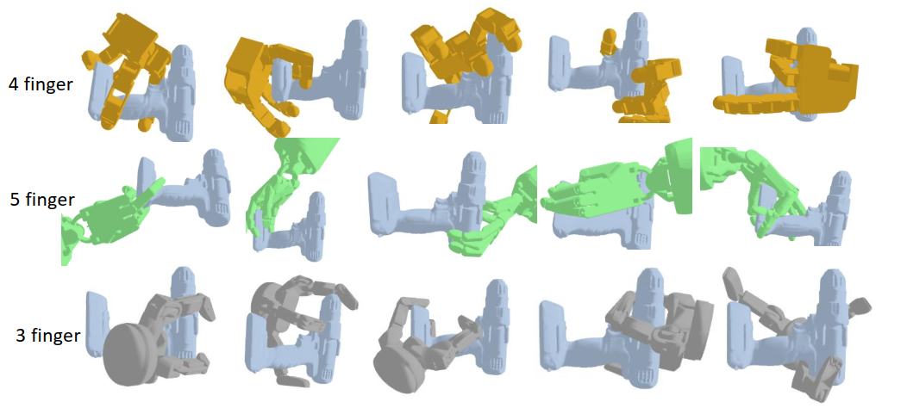
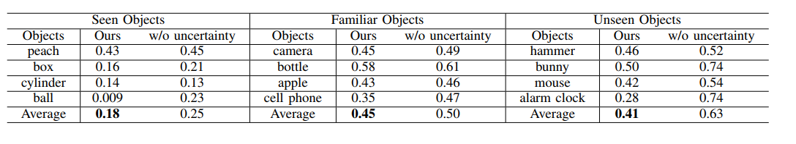
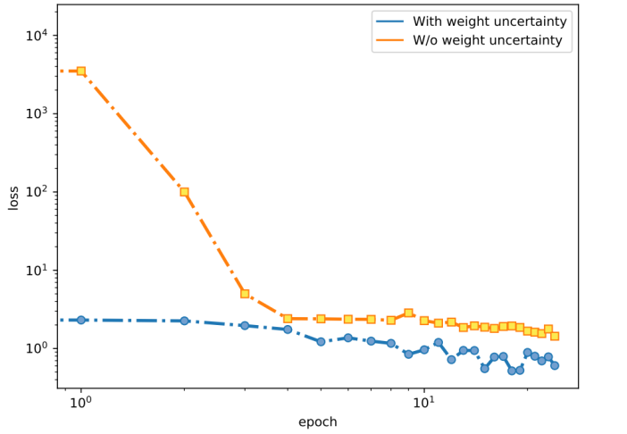

# Supplementary material of Bayesian Grasp Synthesis: Mastering Contact Maps for Dexterous Grasping

## Supplementary experiments

###  Grasp synthesis in a variety of kinematically different robotic hands.

###  An illustration of generated diverse dexterous grasping for given object.

### Reconstructing error contact maps of different objects. The lower the result, the better

###  Loss function with and without weight uncertainty.

